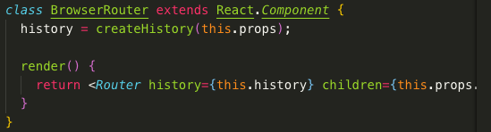
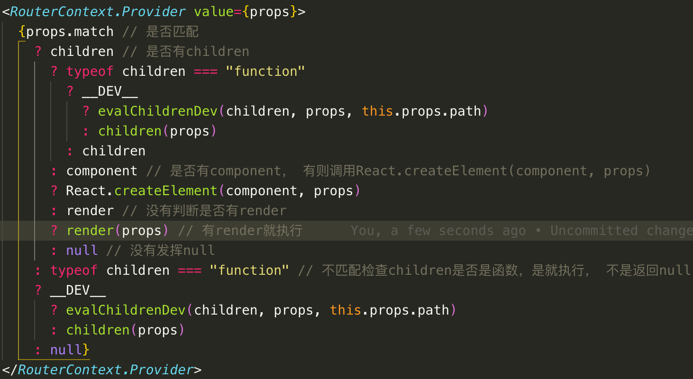
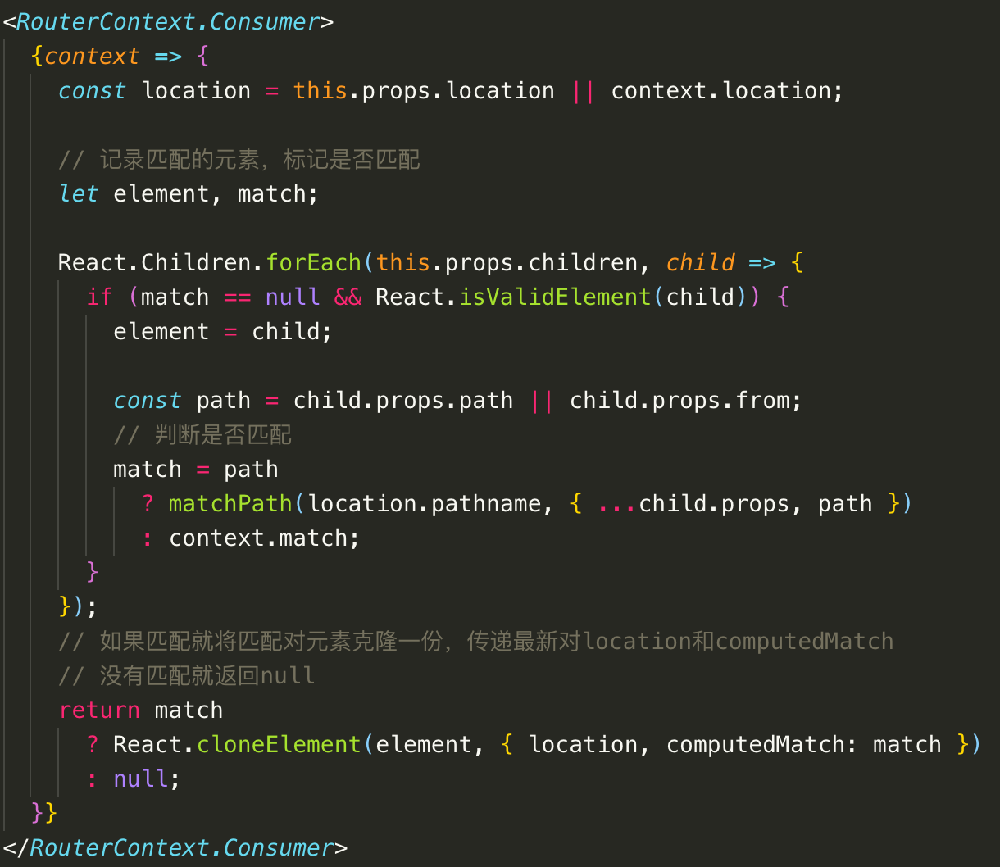
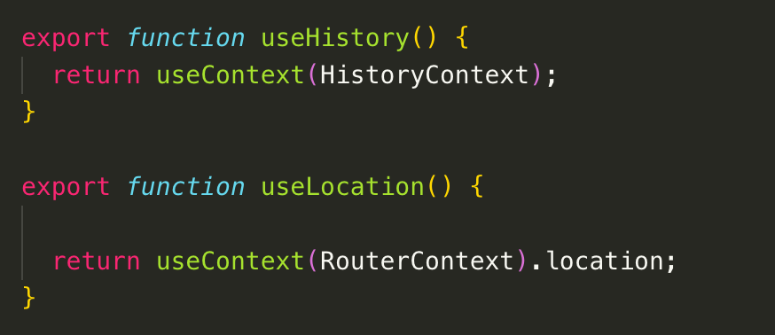

## React Router源码

> 阅读版本是当前最新版本5.2.0。
>
> [React Router中文文档](http://react-router.docschina.org/)

React Router源码整体结构比较清晰，也没有很复杂的逻辑，就是完成各个路由组件，对于组件中使用到的location、history、match等都是通过context进行传递和获取的。大部分的文件都放在了react-router文件夹下的modules文件夹下。

#### BrowserRouter

BrowserRouter文件十分简单，就是获取history，并将其传给Router组件。

这里的createHistory()方法引用history的库。

HashRouter和MemoryRouter文件其实都是一样的结构，只是传给Router的history不一样而已

#### Router

Router组件主要做了三件事：

- 初始化match
- 监听路由变化，设置最新的location
- 使用context将history、location、match等传给子组件

#### Route

Route组件会稍微复杂些，主要复杂点是对于使用那种方式进行渲染的，我们知道定义路由时可以给Route组件传递path、exact还有组件渲染的三种方式：children、component、render。

先看下源码中是如何做判断的:

用了很多条件的判断。我们知道渲染的优先级是children > component > render。并且设置了chidren不管是否匹配都会渲染。所以整体是这样进行判断的：

- 先判断是否匹配上，如果匹配，则判断是否有children，有children则判断children是否是函数，是就执行，不是就返回children
  - 如果没有children则判断是否有component，有则使用React.createElement()
  - 如果没有component，则判断是否有render，有则执行render函数，没有返回null。到此匹配情况下的逻辑就完成了
- 如果没有匹配上则判断children是否是函数，是就执行，不是就返回null

#### Link

Link本质就是a标签跳转，然后对传进来的props参数进行处理，如to，replace等，还对点击事件做了处理，a标签阻止默认事件等。同时用React.forwardRef()使其能接受ref并转发到其他组件树下等另一个组件，同时也对react15版本的ref做了下兼容。

#### Switch

Switch独占路由，渲染与该地址匹配等第一个字组件<Route>或者 <Redirect>，其实就是遍历子组件，检查是否匹配，只要匹配就渲染，不匹配返回null，使用了React.Children.forEach进行遍历。

#### Redirect

判断prop参数，默认使用replace方式跳转，引用了Lifecycle组件，Lifecycle组件返回null，在componentDidMount等生命周期中执行父组件传下来的方法

#### withRouter

使用高阶组件和RouterContext将props和context传递给传进来的组件

#### hooks

可以使用hook获取相应的参数，如location使用useLocation()等。其实useLocation，useHistory方法都特别简单，利用context获取下相应的location和history而已。

